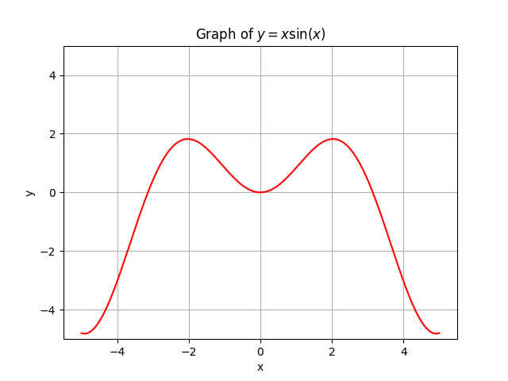
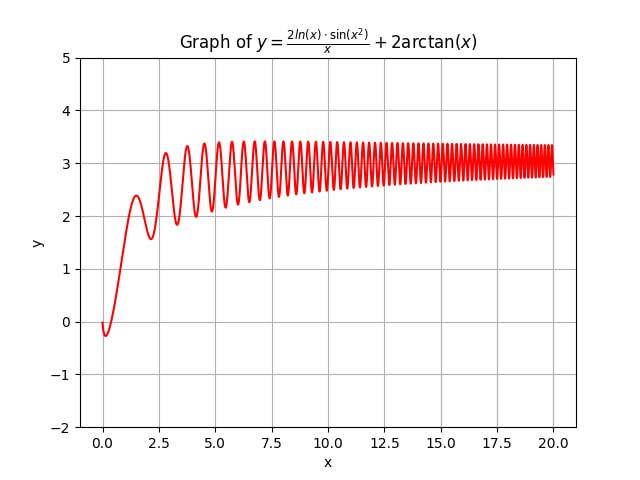

# plot_visualizer

A small command-line tool for plotting mathematical functions of one variable.
You type an expression in a Wolfram-like syntax (e.g. `x*sin(x)`, `2*ln(x)*sin(x^2)/x + 2*arctg(x)`),
the script converts it to a NumPy expression, filters out non-finite values, and renders the
graph with matplotlib — including an auto-generated LaTeX title.

## Examples

| Input | Result |
| --- | --- |
| `y = x*sin(x)` with X borders `-5, 5` and Y borders `-5, 5` |  |
| `y = 2*ln(x)*sin(x^2)/x + 2*arctg(x)` with X borders `0, 20` and Y borders `-2, 5` |  |

## Requirements

- Python 3.10+ (uses PEP 604-style type hints, e.g. `tuple[int, int]`)
- See [requirements.txt](requirements.txt) for Python packages

## Installation

```bash
git clone https://github.com/<your-user>/plot_visualizer.git
cd plot_visualizer
python -m venv .venv
# Windows
.venv\Scripts\activate
# macOS / Linux
source .venv/bin/activate
pip install -r requirements.txt
```

## Usage

```bash
python plot_visualizer.py
```

You will be prompted for four inputs:

1. **`y = `** — the function expression.
2. **`X borders`** — two comma- or space-separated numbers (e.g. `-5, 5`).
   - Leave empty for **adaptive** borders: the script samples the function and trims X to where it's defined. For `sqrt(x)` you'll get roughly `(-0.6, 12.6)`; for `arcsin(x)`, `(-1.1, 1.1)`. Functions defined everywhere fall back to the default range `(-12, 12)`.
   - Type `R` to use a very wide range `(-1000, 1000)` — useful when you want to see global behavior of a quickly-shrinking function.
3. **`Y borders`** — same format as X borders. Controls the visible vertical window via `plt.ylim`.
   - Leave empty for **adaptive** borders: Y is fit to the observed range of the function, capped by the default `(-12, 12)` window. `sqrt(x)` gives `(-0.3, 3.9)`; `e^(-x^2)` gives `(-0.1, 1.1)`; unbounded functions like `1/x` or `tan(x)` fall back to the default.
4. **LaTeX name** — an optional LaTeX-formatted title (inside `$...$`).
   - Leave empty to auto-generate a LaTeX title from the expression.

Close the matplotlib window to exit, or press `Ctrl+C` in the terminal.

### Expression syntax

The expression follows a relaxed, Wolfram-style syntax. The script rewrites it
into valid NumPy code before evaluating it.

| You can write | Meaning |
| --- | --- |
| `^` | exponentiation (rewritten to `**`) |
| `sin`, `cos`, `tan` / `tg`, `cot` / `ctg` | trigonometric functions |
| `arcsin`, `arccos`, `arctan` / `arctg` | inverse trig functions |
| `ln` | natural logarithm |
| `log(base, x)` | logarithm with arbitrary base |
| `e^x`, `e^(expr)` | exponential function |
| `sqrt(x)` | square root |
| `abs(x)` | absolute value |
| `pi`, `e` | mathematical constants |

Examples:

```
x^2 - 3x + 1
sin(x)/x
e^(-x^2)
log(2, x)
2*ln(x)*sin(x^2)/x + 2*arctg(x)
```

### Notes on the LaTeX auto-title

The built-in LaTeX converter is intentionally minimal — it handles common cases
(exponents, trig/log function names, implicit multiplication spacing) but it is
not a full parser. If your title comes out wrong, re-run and supply a custom
LaTeX string at the fourth prompt, e.g. `\\frac{\\sin x}{x}`.

## Configuration

A few constants at the top of [plot_visualizer.py](plot_visualizer.py) can be
tweaked:

- `FUNC_QUALITY` — number of sample points used to draw the curve (default `10000`).
- `DEFAULT_X_BORDERS`, `DEFAULT_Y_BORDERS` — used when the user leaves the borders prompt empty.
- `INFINITY_RANGE` — the range used when the user types `R` at the borders prompt.

## How it works

1. **Input** — read the expression, viewport, and optional LaTeX title from stdin.
2. **Rewrite** — `_process` converts Wolfram-style syntax (`^`, `tg`, `ln`, `e^...`, `log(b, x)`, …) into a NumPy expression.
3. **Sample & filter** — `_filter_function` evaluates the expression on `FUNC_QUALITY` points and drops non-finite values (division by zero, `log` of negatives, etc.) so matplotlib draws cleanly.
4. **Title** — if no custom title is supplied, `_latex_parse` produces a LaTeX-friendly version of the original expression.
5. **Plot** — render with matplotlib (`grid=True`, fixed Y limits, red curve).

## Security note

The expression is evaluated with Python's `eval` (restricted to `x` and `np`).
This is fine for personal use, but **do not** wire this script up to untrusted
input without first replacing `eval` with a safe expression parser
(e.g. [`asteval`](https://pypi.org/project/asteval/) or
[`sympy`](https://www.sympy.org/)).
